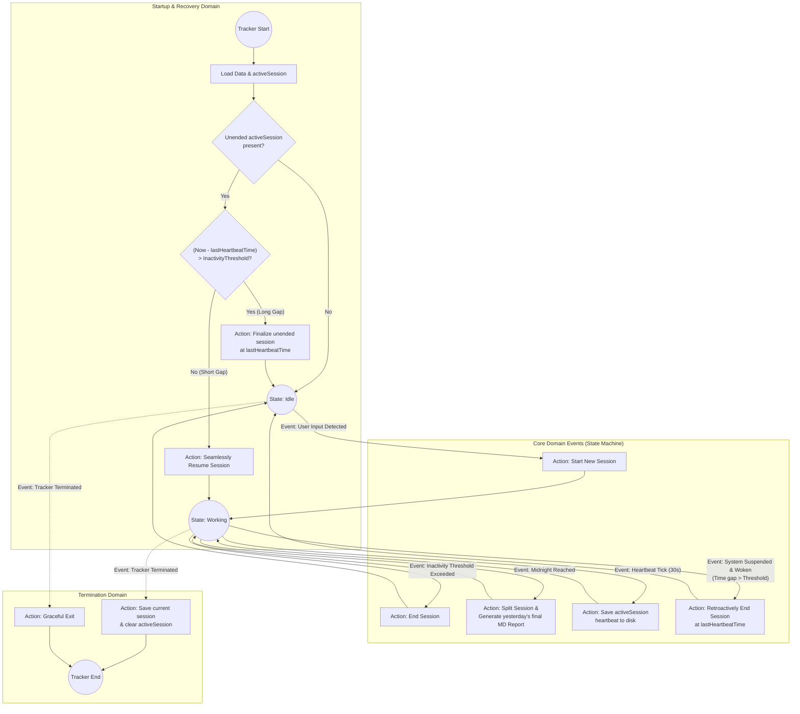

# Worktime Tracker: Domain Logic

This document illustrates the pure Domain Driven Design (DDD) model for the work tracker, separating core domain behaviors and events from technical implementation details.

## Domain Logic Highlights

### 1. State-Driven Architecture
The domain operates primarily between two states: **Idle** and **Working**. Transitions between these states are triggered by pure domain events (e.g., User Input, Inactivity, Midnight, System Suspend).

### 2. Event: Startup Recovery
"activeSession present" means an unended session was found saved on disk, indicating a previous instance of the tracker was closed improperly. On startup, the tracker evaluates the time gap since the last heartbeat. If the gap is small (less than `$InactivityThreshold`), it seamlessly resumes the "Working" state. If it's a large gap (e.g., computer restarted the next day), it finalizes the lost session.

### 3. Event: Midnight Reached
Sessions that span across midnight trigger an automatic split into two parts: one ending at 23:59:59 of the previous day, and another starting at 00:00:00 of the new day. At the moment of this split, the final markdown report for the previous day is explicitly generated. This maintains accurate daily boundaries and ensures the previous day's log is complete.

### 4. Event: Inactivity Threshold Exceeded
The domain considers the user "Working" as long as the time since their last input stays below the `$InactivityThreshold`. When this threshold is exceeded, the session ends.

### 5. Event: Heartbeat Tick
While in the "Working" state, a periodic heartbeat event saves the state to disk. This ensures that any sudden interruptions won't result in total data loss.

### 6. Event: System Suspended & Woken
If the system is suspended (e.g., sleep mode) while working, an event detects the sudden massive jump in time upon waking up. This automatically triggers a retroactive session closure at the last known heartbeat, preventing "sleep hours" from inflating work time.
