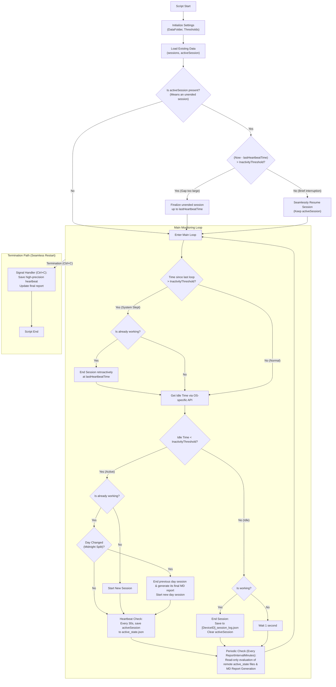

# Worktime Tracker Flowchart

This document provides a visual overview of the Go tracker client's logic, including session tracking, recovery, and periodic reporting.

## Logic Highlights

### 1. Startup Recovery
"activeSession present" means an unended session was found saved on disk, indicating a previous instance of the script was closed improperly. On startup, the tracker checks the time gap since the last heartbeat. If the gap is small (less than `$InactivityThreshold`), it seamlessly resumes the session. If the gap is large, it finalizes the lost session up to the last heartbeat to ensure work time is not lost.

### 2. Midnight Split
Sessions that span across midnight are automatically split into two parts: one ending at 23:59:59 of the previous day, and another starting at 00:00:00 of the new day. This ensures accurate daily statistics.

### 3. Idle Detection
The client uses OS-specific APIs (e.g. `GetLastInputInfo` on Windows, `ioreg` on macOS, `xprintidle` on Linux) to detect when you've been inactive. A session only counts as "work" if your idle time stays below the `$InactivityThreshold`.

### 4. Heartbeat System
To prevent data loss, the client saves its state every 30 seconds while you are working. This "heartbeat" is what enables the recovery system.

### 5. Graceful Exit (Seamless Restart)
When you terminate the client (e.g., by closing the terminal or pressing `Ctrl+C`), it does not forcefully end the session. Instead, it saves a final, precise heartbeat. This defers the decision to the next startup: if you restart the client within `$InactivityThreshold` (e.g., for an update), it seamlessly resumes. If not, it is correctly finalized.

### 6. Sleep/Suspend Detection
If the computer is put to sleep while working, the loop measures an unexpectedly large time delta (greater than `$InactivityThreshold`) upon waking up. When this is detected, the client gracefully recovers by closing the session retroactively at the time of the last known loop tick before sleep, preventing the sleep duration from being logged as active work time.

### 7. Read-Only Cross-Device Projection (Single-Writer Architecture)
To eliminate OneDrive sync conflicts, each device strictly writes only to its own log and state files. When generating unified reports, the reporting engine performs a read-only evaluation of all `active_state*.json` files. If another device's active session is stale (older than `$InactivityThreshold`), it is dynamically projected into the report in-memory without modifying any remote disk files.
