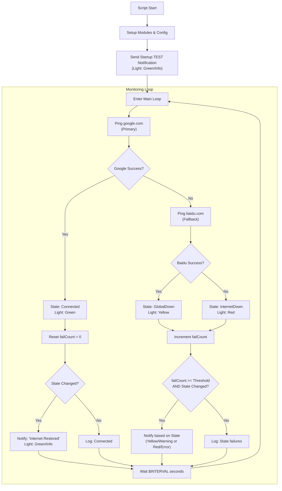

# Internet Monitor Flowchart

This document visualizes the enhanced logic of the `internet_monitor.ps1` script, which distinguishes between global and local connectivity issues.

## Logic Highlights

### 1. Granular Connection States
- **Connected (Green)**: Google is reachable. All is well.
- **Global Internet Not Reachable (Yellow)**: Google is down but Baidu is up. This often indicates a VPN issue or a localized block on international traffic.
- **Internet Interrupted (Red)**: Both Google and Baidu are down. This usually means your local internet connection is completely lost.

### 2. Color-Coded Notifications (Lights)
The script uses visual cues in both the terminal and Windows notifications:
- **Green (Info)**: Used for restoration and successful startup.
- **Yellow (Warning)**: Used for global connectivity issues.
- **Red (Error)**: Used for complete internet outages.

### 3. Smart Alerting
The script only sends notifications when the connection state actually *changes* (e.g., from Connected to GlobalDown). This prevents repeated alerts while the connection remains in a specific down state, though terminal logging continues to show the current failure count.
