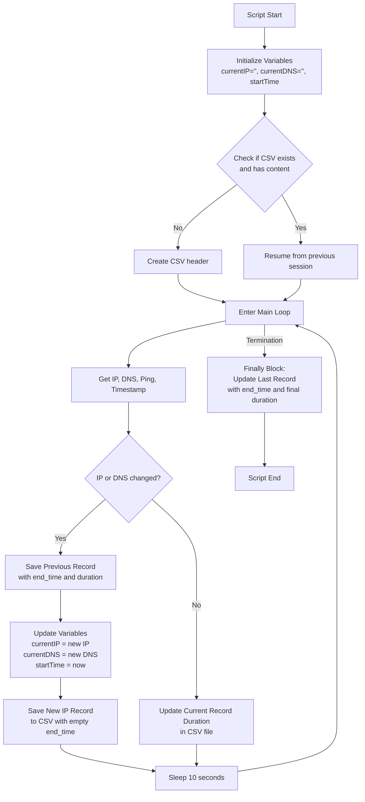

# IP Logger Script Flowchart

## Flow Description

The IP Logger script monitors internet connection changes and logs them to a CSV file. Key features:

1. **Initialization**: Sets up variables and creates CSV header if needed
2. **Main Loop**: Every 10 seconds, gets current IP/DNS/ping data
3. **Change Detection**: If IP or DNS changed, saves the previous session record and starts a new one
4. **Duration Updates**: On every heartbeat (changed or not), updates the duration of the current session in the CSV
5. **Termination**: When script ends, updates the final record with end time and duration

This ensures that:
- New IP changes are logged immediately
- Current session duration is always up-to-date in the CSV
- Power outages only lose at most 10 seconds of data
- Manual termination properly closes the current session record