# Speed Monitor Flowchart

```mermaid
flowchart TD
    Start([Start Speed Monitor]) --> Init["Initialize<br/>- Setup log directory<br/>- Load config"]
    Init --> MainLoop["Main Loop"]
    
    MainLoop --> Latency["Measure Latency<br/>(Ping 8.8.8.8)"]
    Latency --> PingResult{Ping<br/>Success?}
    PingResult -->|Yes| StoreLatency["Store Latency<br/>in ms"]
    PingResult -->|No| LogPingError["Log Error<br/>Set Latency = 0"]
    
    StoreLatency --> DL["Start Download<br/>Speed Test"]
    LogPingError --> DL
    
    DL --> Download["Download Test File<br/>from Server"]
    Download --> CalcDL["Calculate Speed<br/>= File Size ÷ Time"]
    CalcDL --> DLResult{Download<br/>Success?}
    DLResult -->|Yes| StoreDL["Store Download<br/>Speed in Mbps"]
    DLResult -->|No| LogDLError["Log Error<br/>Set DL = 0"]
    
    StoreDL --> Upload["Simulate Upload<br/>Speed"]
    LogDLError --> Upload
    
    Upload --> StoreUL["Store Upload<br/>Speed in Mbps"]
    
    StoreUL --> CheckThresholds["Check Against<br/>Thresholds"]
    CheckThresholds --> DLCheck{DL Speed<br/>&gt;= Limit?}
    DLCheck -->|Yes| DLGood["DL Status: 🟢"]
    DLCheck -->|No| DLWarn["DL Status: 🟡"]
    
    DLGood --> ULCheck{UL Speed<br/>&gt;= Limit?}
    DLWarn --> ULCheck
    ULCheck -->|Yes| ULGood["UL Status: 🟢"]
    ULCheck -->|No| ULWarn["UL Status: 🟡"]
    
    ULGood --> LatCheck{Latency<br/>&lt;= Limit?}
    ULWarn --> LatCheck
    LatCheck -->|Yes| LatGood["Latency: 🟢"]
    LatCheck -->|No| LatWarn["Latency: 🟡"]
    
    LatGood --> Format["Format Results<br/>in Output Box"]
    LatWarn --> Format
    
    Format --> Display["Display Results<br/>to Console"]
    Display --> Log["Log Results<br/>to File"]
    
    Log --> Wait["Wait 300 seconds<br/>(5 minutes)"]
    Wait --> CheckInput{User Input<br/>or Timeout?}
    CheckInput -->|Timeout| MainLoop
    CheckInput -->|'q' Pressed| Stop["Log: 'Stopped'"]
    CheckInput -->|Ctrl+C| Stop
    Stop --> End([Exit])
```



## Process Flow

1. **Initialization**
   - Create log directory if missing
   - Load configuration parameters
   - Display startup message

2. **Speed Test Cycle**
   - Measure network latency (ping)
   - Measure download speed (file download)
   - Measure upload speed (simulated)

3. **Threshold Checking**
   - Compare each metric against configured limits
   - Assign status indicators (🟢 good, 🟡 warning)

4. **Reporting**
   - Format results in visual box
   - Display to console
   - Log to daily file

5. **Wait & Loop**
   - Sleep for configured interval (default 5 minutes)
   - Check for user input (Ctrl+C or 'q')
   - Return to step 2 or exit

## Data Flow

```
[Test Server] 
    ↓
[Download Test] → Speed Calculation → Mbps Result
    ↓
[Network Ping]  → Latency Calculation → ms Result
    ↓
[Upload Sim]    → Upload Calculation → Mbps Result
    ↓
[Threshold Check] → Status Icons (🟢/🟡/🔴)
    ↓
[Format Output] → Console Display + Log File
```

## Configuration Parameters

| Parameter | Default | Purpose |
|-----------|---------|---------|
| INTERVAL | 300s | Time between tests |
| DOWNLOAD_LIMIT | 10 Mbps | Speed warning threshold |
| UPLOAD_LIMIT | 5 Mbps | Speed warning threshold |
| LATENCY_LIMIT | 100 ms | Latency warning threshold |
| TEST_SERVER_URL | Otenet | Speed test server |
