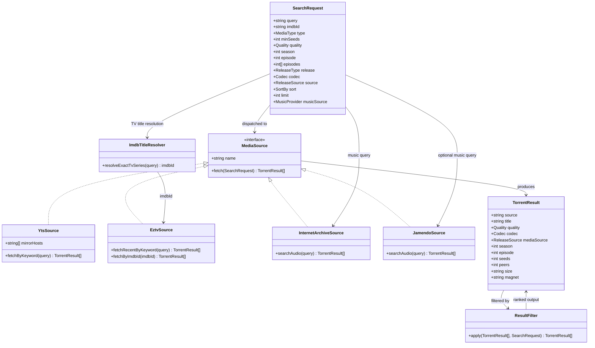
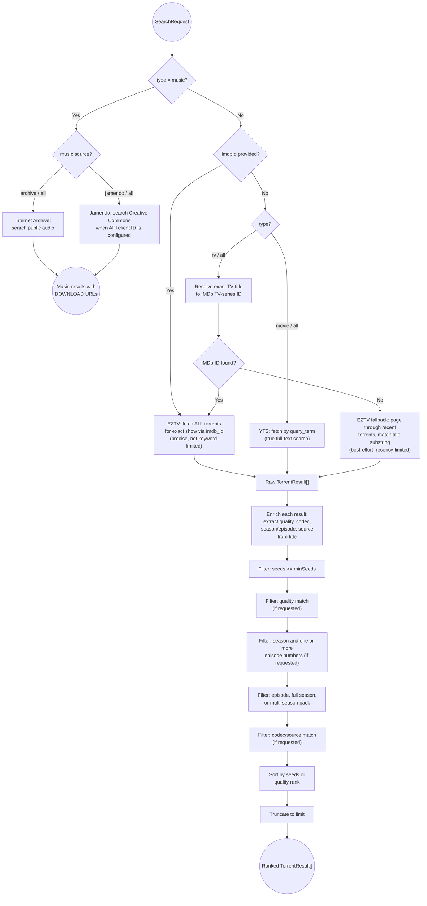

# Torrent Finder: Domain Model

This document describes the domain model for Torrent Finder: the core entities, their relationships, and the search/filter pipeline, independent of the specific YTS/EZTV API implementation details.

## Domain Flow

## Domain Concepts

### 1. TV Lookup Prefers an Exact IMDb Match
A TV title is first resolved through IMDb's title-suggestion endpoint. An exact TV-series match supplies the `imdb_id` for EZTV's precise lookup, which is paged through the complete indexed catalog. `--imdb` skips resolution and selects the show directly. The recent-torrents keyword scan remains a fallback only when an exact TV title cannot be resolved.

### 2. Enrichment Combines API Fields and Title Metadata
EZTV provides native `season`, `episode`, seed, peer, and byte-size fields. The domain uses those season/episode fields first, falling back to title extraction when absent. Quality, codec, release source, and release type are derived from the title so YTS and EZTV normalize into one `TorrentResult` shape.

### 3. Filtering is Additive and Order-Independent
Each filter (`minSeeds`, `quality`, `season`, `episode`/`episodes`, `release`, `codec`, `source`) narrows the candidate set independently; an unset filter is a no-op. `release` distinguishes individual episodes, full-season releases, and multi-season/complete packs.

### 4. "High Quality" is a Ranking, Not a Boolean
Rather than a single pass/fail definition, quality is expressed as a **rank** (`2160p > 1080p > 720p > 480p > SD`) used for `--sort quality`. Combined with `--min-seeds`, this lets the user trade off resolution against download health rather than treating "high quality" as one fixed threshold.

### 5. Music Uses Provider-Specific Download URLs
Music is an explicit `type = music` mode so the default movie/TV workflow remains unchanged. Internet Archive is available without configuration and returns legal collection torrent URLs. Jamendo is optional because its API requires a client ID; when configured through `JAMENDO_CLIENT_ID`, it returns the direct audio URL supplied by Jamendo. Music is not subject to torrent seeder or resolution filters.
