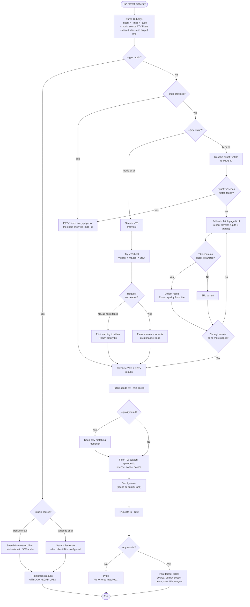

# Torrent Finder Flowchart

## Process Flow

1. **Argument parsing** — read the query/IMDb ID, media type, music provider, TV filters, and shared result options.
2. **YTS search (movies)** — query term is sent directly to the YTS API; tries `yts.mx`, then falls back to `yts.am`/`yts.lt` mirrors if the primary domain is unreachable.
3. **EZTV search (TV shows)** — an exact TV title is first resolved to an IMDb ID and EZTV returns all indexed torrents for that show, paged to completion. If no exact title match is available, the tool falls back to scanning recent torrents (up to 5 pages of 100).
4. **Music search** — `--type music` queries Internet Archive and, when configured, Jamendo. Results provide download URLs rather than torrent magnets.
5. **Combine results** from whichever movie/TV sources were selected via `--type`.
6. **Filter** movie/TV results by minimum seeders, resolution, season, episode(s), release type, codec, and source as requested.
7. **Sort and print** the top `--limit` movie/TV results as a table with magnet links.
