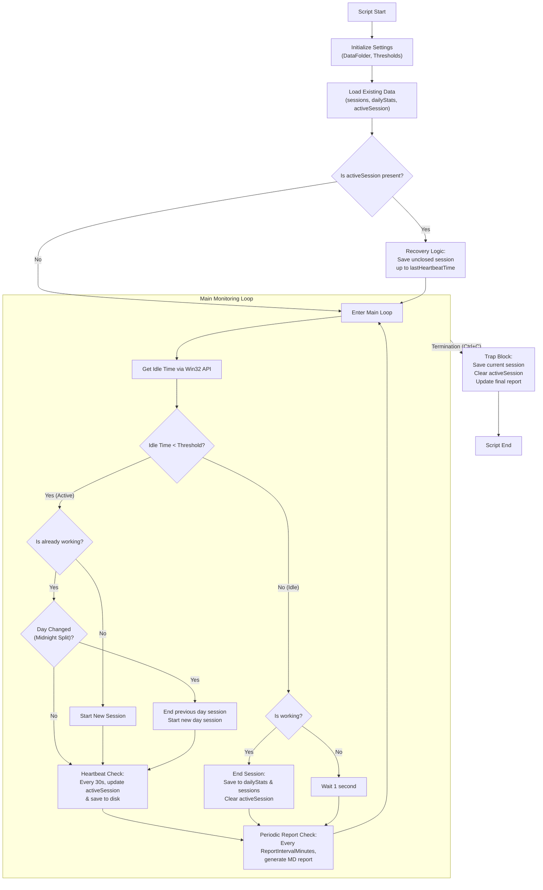

# Worktime Tracker Flowchart

This document provides a visual overview of the `work_time_tracker.ps1` script's logic, including session tracking, recovery, and periodic reporting.

## Logic Highlights

### 1. Startup Recovery
If the script or system crashes, the `activeSession` heartbeat allows the tracker to "recover" the lost session on the next start, ensuring that your work time is not lost.

### 2. Midnight Split
Sessions that span across midnight are automatically split into two parts: one ending at 23:59:59 of the previous day, and another starting at 00:00:00 of the new day. This ensures accurate daily statistics.

### 3. Idle Detection
The script uses the Windows `GetLastInputInfo` API to detect when you've been inactive. A session only counts as "work" if your idle time stays below the `$InactivityThreshold`.

### 4. Heartbeat System
To prevent data loss, the script saves its state every 30 seconds while you are working. This "heartbeat" is what enables the recovery system.

### 5. Graceful Exit
When you terminate the script (e.g., by closing the terminal or pressing `Ctrl+C`), a `trap` block captures the interruption and ensures the current session is saved correctly before exiting.
